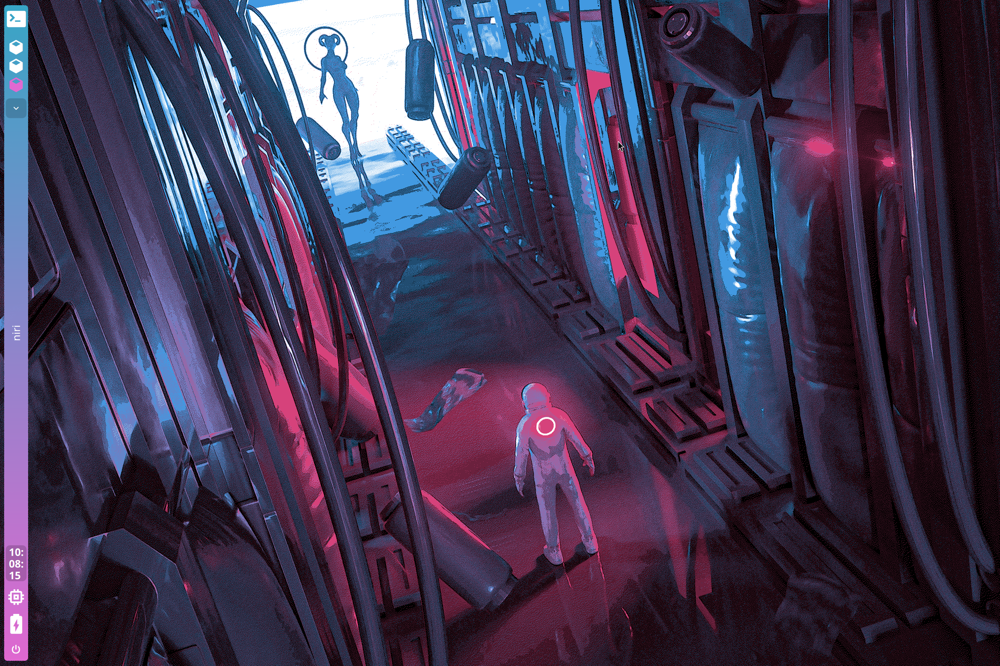

# Dense's Dotfiles

## About


 - OS: [**`Arch Linux`**](https://archlinux.org/)
 - WM: [**`Niri`**](https://github.com/YaLTeR/niri) / [**`Hyprland`**](https://github.com/hyprwm/Hyprland)
 - Bar: [**`Quickshell`**](https://outfoxxed.me/quickshell/)
 - Compositor: [**`Niri`**](https://github.com/YaLTeR/niri) (Built-in)
 - Terminal: [**`Kitty`**](https://github.com/kovidgoyal/kitty)
 - App Launcher: [**`Wofi`**](https://github.com/davatorium/rofi)
 - Notify Daemon: [**`SwayNC`**](https://github.com/ErikReider/SwayNotificationCenter) / [**`Mako`**](https://github.com/emersion/mako)
 - Login Manager: [**`SDDM`**](https://github.com/sddm/sddm)
 - Shell: [**`Zsh`**](https://www.zsh.org/) / [**`Fish`**](https://github.com/fish-shell/fish-shell)
 - Prompt: [**`Starship`**](https://github.com/starship/starship)
 - Music: [**`Spotify`**](https://www.spotify.com/) + [**`Spicetify`**](https://github.com/spicetify/spicetify-cli)

</br>


<!-- IMAGES -->
## Gallery





<!-- FEATURES -->
## Features
* **Automated Installation** - Python scripts handle package installation and configuration deployment
* **Dual Compositor Support** - Configured for both Niri and Hyprland window managers
* **Modern Wayland Setup** - Full Wayland support with XWayland-Satellite for legacy apps
* **Beautiful Prompts** - Starship prompt configuration for both Zsh and Fish shells
* **Custom Quickshell Bar** - Highly customizable status bar with modern aesthetics
* **Notification Center** - SwayNC for a beautiful notification management experience
* **Terminal Eye Candy** - Includes Cava, CMatrix, CBonsai, Pipes.sh, and more visualizers
* **Developer Tools Ready** - Git Credential Manager, Docker, Podman, VirtualBox support
* **Personal App Collection** - Optional installation of Obsidian, Emacs, VS Code, Zen Browser, and more
* **Music Customization** - Spicetify for customizing Spotify appearance
* **Easy Sync** - Bidirectional sync scripts to keep repo and home directory in sync
* **SDDM Integration** - Custom login screen background configuration

<table align="center">
   <tr>
      <th align="center">
         <sup>NOTE</sup>
      </th>
   </tr>
   <tr>
      <td align="center">
        THIS CONFIGURATION IS DESIGNED FOR ARCH LINUX WITH WAYLAND.
        SOME FEATURES MAY REQUIRE MANUAL ADJUSTMENTS FOR YOUR SPECIFIC SETUP.
        THE SCRIPTS USE PARU FOR AUR PACKAGE MANAGEMENT.
        IF YOU FIND ISSUES, PLEASE REPORT THEM.
   </tr>
   </table>


<!-- INSTALLATION -->
## Installation

### Prerequisites
- Fresh Arch Linux installation
- Internet connection
- Git installed (`sudo pacman -S git`)

### Quick Start

1. **Clone the repository**
   ```bash
   cd ~/Projects/Github  # or your preferred location
   git clone https://github.com/yourusername/dotfiles.git
   cd dotfiles
   ```

2. **Install packages** (requires sudo)
   ```bash
   sudo python3 install_packages.py
   ```
   
   This script will:
   - Install and configure Paru (AUR helper)
   - Install all core packages (Niri, Hyprland, Kitty, etc.)
   - Set up Zsh as default shell
   - Optionally install personal applications (Obsidian, VS Code, Spotify, etc.)
   - Configure Git Credential Manager

3. **Deploy dotfiles** (requires sudo)
   ```bash
   sudo python3 deploy_dotfiles.py
   ```
   
   This script will:
   - Back up existing configurations
   - Deploy all dotfiles to your home directory
   - Set up SDDM background
   - Set proper file permissions

4. **Restart your system**
   ```bash
   sudo systemctl reboot
   ```

5. **Select your window manager**
   - At the SDDM login screen, choose either Niri or Hyprland from the session menu


### Script Options

**Installation Script (`install_packages.py`)**
- Fully interactive with prompts for personal applications
- No command-line options needed

**Deployment Script (`deploy_dotfiles.py`)**
- `--dry-run` or `-n`: Preview what would be deployed without making changes
- `--force` or `-f`: Deploy without confirmation prompt
- `--help` or `-h`: Show help information

**Example:**
```bash
# Preview deployment without making changes
sudo python3 deploy_dotfiles.py --dry-run

# Deploy without confirmation
sudo python3 deploy_dotfiles.py --force
```


<!-- SYNC -->
## Syncing Configurations

After making changes to your dotfiles, sync them back to the repository:

```bash
python3 sync_to_repo.py
```

**Options:**
- `--dry-run` or `-n`: Preview what would be synced
- `--force` or `-f`: Sync without confirmation
- `--check` or `-c`: Only check for differences (exit code 1 if found)

This script:
- Syncs configurations from `~/.config/` back to the repo
- Only syncs items that exist in both locations
- Creates backups with `.old` suffix
- Uses additive sync (never deletes files in repo)


<!-- INCLUDED CONFIGS -->
## Included Configurations

- **`.config/niri/`** - Niri window manager configuration
- **`.config/hypr/`** - Hyprland window manager configuration
- **`.config/quickshell/`** - Custom status bar configuration
- **`.config/kitty/`** - Kitty terminal emulator settings
- **`.config/fish/`** - Fish shell configuration
- **`.config/wofi/`** - Application launcher styling
- **`.config/swaync/`** - Notification center configuration
- **`.config/spicetify/`** - Spotify customization
- **`.config/cava/`** - Audio visualizer configuration
- **`.config/fastfetch/`** - System information tool config
- **`.zshrc`** - Zsh shell configuration
- **`starship.toml`** - Starship prompt configuration
- **`sddm_background.png`** - Login screen background


<!-- PACKAGES -->
## Installed Packages

### Core System
- **xwayland-satellite** - XWayland support for Niri
- **niri** - Scrollable-tiling Wayland compositor
- **hyprland** - Dynamic tiling Wayland compositor
- **quickshell** - Flexible and powerful status bar

### Terminal & Shell
- **zsh** - Z shell (set as default)
- **fish** - Friendly interactive shell
- **kitty** - GPU-accelerated terminal emulator
- **starship** - Cross-shell prompt

### System Info & Monitoring
- **neofetch** - System information tool
- **fastfetch** - Faster neofetch alternative
- **htop** - Interactive process viewer

### Appearance & UI
- **wofi** - Wayland application launcher
- **swaync** - Notification daemon for Wayland
- **mako** - Lightweight notification daemon
- **sddm** - Display manager
- **hyprpaper** - Wallpaper utility for Hyprland

### Entertainment & Visualization
- **cava** - Console audio visualizer
- **cmatrix** - Matrix rain effect
- **cbonsai** - Grow bonsai trees in terminal
- **pipes.sh** - Animated pipes screensaver
- **donut.c** - Spinning 3D donut
- **termdown** - Terminal countdown timer
- **spicetify-cli** - Spotify customization tool

### Personal Applications (Optional)
- **zen-browser-bin** - Privacy-focused web browser
- **zed** - Modern code editor
- **visual-studio-code-bin** - VS Code editor
- **obsidian** - Knowledge base and note-taking
- **spotify** - Music streaming client
- **git-credential-manager-core** - Git credential helper
- **pass** - Password manager
- **gnupg** - GPG encryption
- **docker** + **docker-compose** - Container platform
- **podman** + **podman-compose** - Daemonless container engine
- **virtualbox** - Virtual machine software
- **emacs** - Extensible text editor


<!-- ERRORS -->
## Troubleshooting

### Common Issues

* **Paru installation fails**
  - Ensure `git` and `base-devel` are installed: `sudo pacman -S git base-devel`
  - Check your internet connection
  - Make sure you're running with sudo privileges

* **Permission errors during deployment**
  - The deploy script must be run with sudo: `sudo python3 deploy_dotfiles.py`
  - Check that files aren't locked by another process

* **Niri doesn't start**
  - Check logs: `journalctl -u niri`
  - Ensure XWayland-Satellite is installed
  - Verify your GPU drivers are installed

* **SDDM background not showing**
  - Check `/etc/sddm.conf` for correct background path
  - Restart SDDM: `sudo systemctl restart sddm`
  - Verify image exists at `/usr/share/sddm/themes/background.png`

* **Quickshell bar not appearing**
  - Check Quickshell logs for errors
  - Ensure all dependencies are installed
  - Verify configuration syntax in `~/.config/quickshell/`

* **Shell changes not taking effect**
  - Log out and back in after running install script
  - Verify shell was changed: `echo $SHELL`
  - Manually change if needed: `chsh -s /usr/bin/zsh`

* **Spicetify not working**
  - Run spicetify backup and apply: `spicetify backup apply`
  - Check Spotify installation path
  - Ensure Spotify is closed before applying themes

### Post-Installation Tasks

1. **VS Code Settings Sync**
   - Open VS Code → Ctrl+Shift+P → "Settings Sync: Turn On"
   - Sign in with GitHub or Microsoft account

2. **Git Configuration**
   - Set up Git Credential Manager for your repositories
   - Configure your Git identity: `git config --global user.name "Your Name"`

3. **Spotify Theming**
   - Run `spicetify backup apply` to apply custom theme
   - Explore themes at [spicetify-themes](https://github.com/spicetify/spicetify-themes)

4. **Niri Keybindings**
   - Review and customize keybindings in `~/.config/niri/config.kdl`
   - Add media controls, screenshot tools, etc.


<!-- HOTKEYS -->
## Default Keybindings

> **Note:** Keybindings may vary based on your Niri/Hyprland configuration. 
> Check `~/.config/niri/config.kdl` or `~/.config/hypr/hyprland.conf` for your specific setup.

### Common Bindings (Niri)
* **Open terminal** - `Super + Enter`
* **Open launcher** - `Super + D`
* **Close window** - `Super + Q`
* **Switch workspace** - `Super + 1-9`
* **Move window to workspace** - `Super + Shift + 1-9`
* **Toggle floating** - `Super + Space`
* **Reload configuration** - `Super + Shift + R`

### Media Controls
* **Play/Pause** - Configure in Niri config
* **Volume controls** - Configure in Niri config

> Customize these in your compositor configuration files!


<!-- STRUCTURE -->
## Repository Structure

```
dotfiles/
├── .config/               # Application configurations
│   ├── niri/             # Niri compositor config
│   ├── hypr/             # Hyprland config
│   ├── quickshell/       # Status bar config
│   ├── kitty/            # Terminal config
│   ├── fish/             # Fish shell config
│   ├── wofi/             # App launcher config
│   ├── swaync/           # Notification center config
│   ├── spicetify/        # Spotify themes
│   ├── cava/             # Audio visualizer config
│   └── fastfetch/        # System info config
├── .zshrc                # Zsh configuration
├── deploy_dotfiles.py    # Deployment script
├── install_packages.py   # Package installation script
├── sync_to_repo.py       # Sync script (home → repo)
├── sddm_background.png   # Login screen background
├── pic1.png - pic4.png   # Gallery screenshots
└── README.md             # This file
```


<!-- CREDITS -->
## Credits & Inspiration

This configuration was inspired by various dotfiles repositories and the awesome Linux customization community. Special thanks to:

- The [Niri](https://github.com/YaLTeR/niri) project for an amazing scrollable-tiling compositor
- The [Hyprland](https://github.com/hyprwm/Hyprland) community for a beautiful Wayland compositor
- The [r/unixporn](https://www.reddit.com/r/unixporn/) community for endless inspiration
- ZProger for the excellent README format

---

<p align="center">Made with love on Arch Linux</p>
