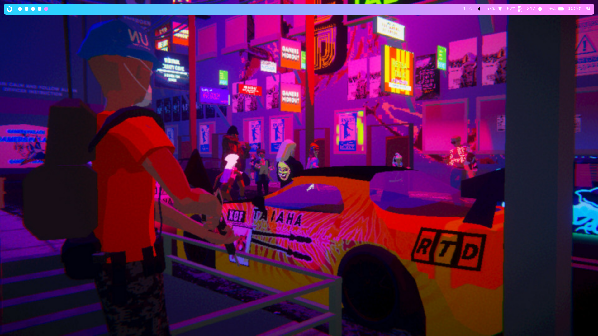
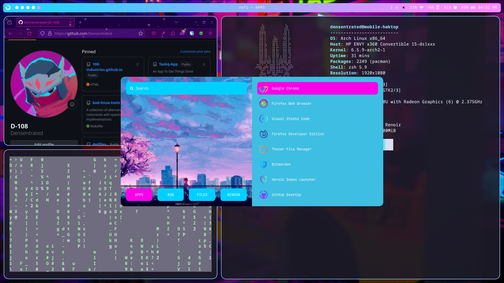

# My personal collection of hyprland dotfiles
## Screenshots  
- 
- 
- 
- 
## Dependencies
- I'm too lazy to list them all so just run the following yay command 
  
## Installation y
## What's included
## Todo??

sudo pacman -S yay git firefox
yay -S google-chrome steam waybar hyprland mako rofi google-chrome-dev itch kitty neofetch starship hyprland pamixer spicetify spotify xdg-desktop-portal-wlr gdm